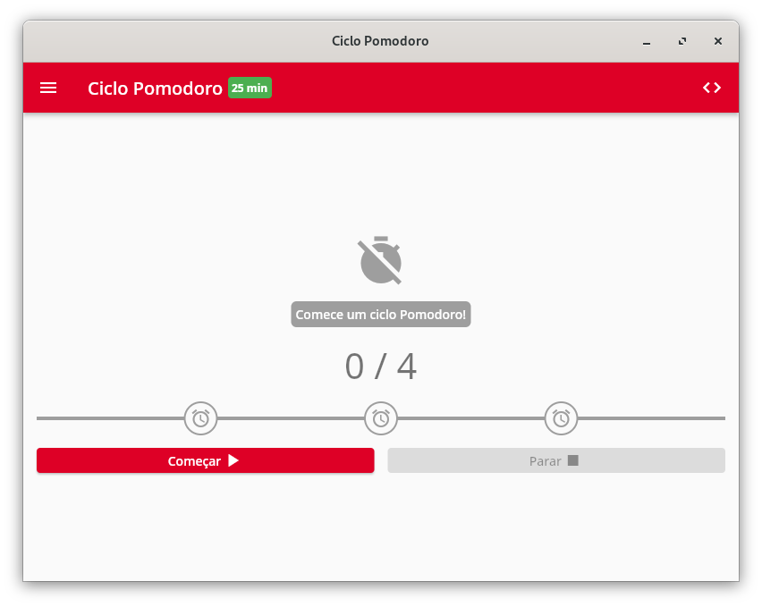

# Ciclo Pomodoro


Controle de tempo, foco e concentração com Pomodoro.

## Get started

[https://eduhds.github.io/ciclo_pomodoro/](https://eduhds.github.io/ciclo_pomodoro/)

<p align="center">
  
</p>

## Development

### Linux

```sh
# Fedora
sudo dnf install -y libappindicator-gtk3-devel
```

## Build

```sh
# Linux
sh scripts/build.sh --linux

# Web
sh scripts/build.sh --web
```

## Credits

<a target="_blank" href="https://icons8.com/icon/ghkv9TV5jWyl/tomato">Tomato</a> icon by <a target="_blank" href="https://icons8.com">Icons8</a>
